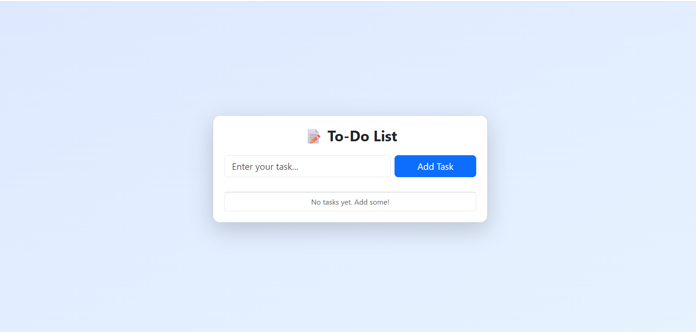

# 📝 To-Do List App

A fully responsive and user-friendly **To-Do List App** built with **React** and **Bootstrap**. This app allows you to manage your daily tasks, mark them as completed, edit, delete, and store them using local storage.

---

## 🚀 Features

- ✅ Add new tasks
- ✅ Edit existing tasks
- ✅ Mark tasks as complete/incomplete
- ✅ Delete tasks
- ✅ Tasks are saved in browser **Local Storage**
- ✅ Fully **responsive** UI using Bootstrap
- ✅ Clean and modern user interface

---

## 📸 Screenshot



> 📌 Make sure to replace the path above with the actual path to your image.

---

## 🛠️ Tech Stack

- React.js (via Vite)
- Bootstrap 5
- JavaScript (ES6+)
- Local Storage API

---

## 📦 Installation

### 1. Clone the Repository

```bash
git clone https://github.com/rdalvi1210/To-do-list_App.git
cd todo-app
```
